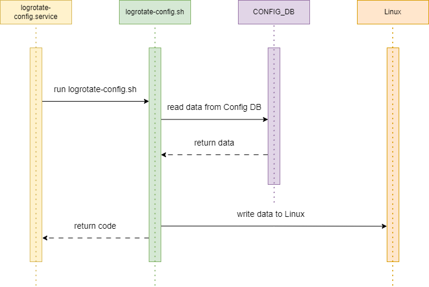
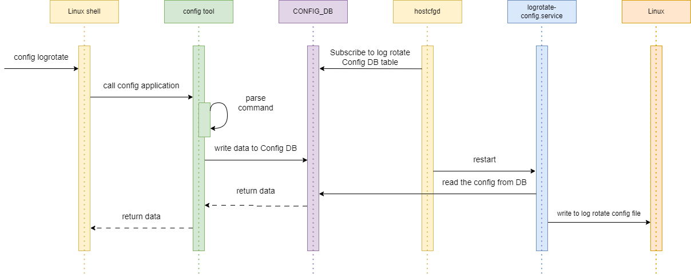

# Log rotate configuration HLD #

## Table of contents
- [Revision](#revision)
- [About this manual](#about-this-manual)
- [Scope](#scope)
- [1 Introduction](#1-introduction)
  - [1.1 Feature overview](#11-feature-overview)
  - [1.2 Requirements](#12-requirements)
- [2 Design](#2-design)
  - [2.1 Overview](#21-overview)
  - [2.2 Flows](#25-flows)
      - [2.2.1 Log rotate init flow](#221-log-rotate-init-flow)
      - [2.2.2 Log rotate config flow](#222-log-rotate-default-configuration-values)
      - [2.2.3 Log rotate show configuration](#223-log-rotate-show-configuration)
  - [2.3 CLI](#23-cli)
      - [2.3.1 Config command group](#231-config-command-group)
      - [2.3.2 Show command](#232-show-command)
  - [2.4 YANG model](#24-yang-model)


# Revision
| Rev | Date       | Author              | Description     |
|:---:|:----------:|:-------------------:|:----------------|
| 0.1 | 02/01/2024 | Yevhen Fastiuk 🇺🇦    | Initial version |


# About this manual
This document provides high-level information for the SONiC log rotate feature and log rotate CLI.
It describes high-level behavior, internal definition, design of the commands, syntax, and output definition.

# Scope
The scope of this document is to cover definition, design and implementation of SONiC Log rotate configuration and log rotate CLI.
The document covers the next CLI:
1.	Commands to configure log rotate setting
2.	Command to display log rotate settings

<!-- omit in toc -->
## Abbreviations
| Term  | Meaning                                   |
|:------|:------------------------------------------|
| SONiC | Software for Open Networking in the Cloud |
| DB    | Database                                  |
| CLI   | Сommand-line Interface                    |
| YANG  | Yet Another Next Generation               |

<!-- omit in toc -->
## List of figures
- [Figure 1: Log rotate system chart diagram](#figure-1-logrotate-system-chart-diagram)
- [Figure 2: Log rotate init flow](#figure-2-logrotate-init-flow)
- [Figure 3: Log rotate config flow](#figure-3-logrotate-config-flow)
- [Figure 4: Log rotate show configuration](#figure-4-logrotate-show-configuration)

# 1 Introduction

## 1.1 Feature overview
This feature performs log rotation separately for syslog and debug files.
The SONiC log rotate feature maintain several configuration parameters:
|  Param            |  Description                                                 |
| :---------------: | :----------------------------------------------------------: |
|  disk-percentage  | Rotate logs when they surpass a specified percentage of disk |
|  frequency        | Log files rotation frequency                                 |
|  max-number       | Max number of log files to keep                              |
|  size             | Rotate logs if they grow bigger than size in Mebibytes       |


## 1.2 Requirements

**This feature will support the following functionality:**
1. Show log rotate configuration
2. Configure log rotate
    1. Disk-percentage
    2. Frequency
    3. Max-number
    4. Size

Configuration commands supports separate configuration for syslog and debug files.

# 2 Design

## 2.1 Overview
Here is the representation of SONiC platform using logrotate feature:


<!-- omit in toc -->
###### Figure 1: Log rotate system chart diagram

This feature requires access to SONiC DB. All log rotate related configuration (disk percentage, frequency and size, etc...) saved into the SONiC config database.
Hostcfgd will listen for the configuration changes in corresponding tables and restart logrotate-config service. Log rotate config service - it is simple SystemD service.
It reads log rotate configuration from database and apply it to log rotate config files.


**The log rotate config files will be used:**
1. /etc/logrotate.d/rsyslog - generic log files
2. /etc/logrotate.d/debug - debug log files
3. /etc/logrotate.d/syslog - syslog files

## 2.2 Flows
<!-- omit in toc -->
### 2.2.1 Log rotate init flow

<!-- omit in toc -->
###### Figure 2: Log rotate init flow

<!-- omit in toc -->
### 2.2.2 Log rotate config flow

<!-- omit in toc -->
###### Figure 3: Log rotate config flow

<!-- omit in toc -->
### 2.2.3 Log rotate show configuration

<!-- omit in toc -->
###### Figure 4: Log rotate show configuration


## 2.3 CLI

<!-- omit in toc -->
### 2.3.1 Command structure

**User interface**:
```
config
\-- logrotate
    |-- disk-percentage <syslog|debug> <disk-percentage>
    |-- frequency <syslog|debug> <freqency>
    |-- max-number <syslog|debug> <max-number>
    |-- size <syslog|debug> <size>

show
\-- logrotate
```

**Options:**

General:
1. `<disk-precentage>` - Rotate logs when they surpass a specified percentage of disk: `float`
2. `<freqency>`        - Log files rotation frequency: `(enum:daily, weekly, monthly, yearly | string)`
3. `<max-number>`      - Max number of log files to keep: `integer`
4. `<size>`            - Rotate logs if they grow bigger than size in Mebibytes: `float`


#### 2.3.1 Config command group
**The following command set log rotate disc percentage:**
```bash
config logrotate disk-percentage <syslog|debug> <disk-percentage>
```

**The following command set log rotate frequency:**
```bash
config logrotate frequency <syslog|debug> <freqency>
```

**The following command set log rotate max-number:**
```bash
config logrotate max-number <syslog|debug> <max-number>
```

**The following command set log rotate size:**
```bash
config logrotate size <syslog|debug> <size>
```

#### 2.3.2 Show command
**The following command display log rotate configuration:**
```bash
root@sonic:/home/admin# show logrotate
file      disk-percentage  frequency      max-number    size
------  -----------------  -----------  ------------  ------
syslog             10.2    daily                  10    20.0
debug              50.5    weekly                 20    10.0
```

## 2.4 YANG model
New YANG model `sonic-logging.yang` will be added to provide support for log rotate configuration.

**Skeleton code:**
```
 module sonic-logging {

    yang-version 1.1;

    namespace "http://github.com/Azure/sonic-logging";
    prefix logging;

    description "LOGGING YANG Module for SONiC-based OS";

    revision 2024-02-02 {
        description "First Revision";
    }

    container sonic-logging {

        container LOGGING {

            description "LOGGING part of config_db.json";

            list LOGGING_LIST {

                key "name";

                leaf name {
                    type string {
                        length 1..255;
                    }
                }

                leaf disk_percentage {
                    type decimal64 {
                        fraction-digits 3;
                        range 0.001..100.0;
                    }
                }

                leaf frequency {
                    type string {
                        pattern "daily|weekly|monthly|yearly";
                    }
                }

                leaf max_number {
                    type int32 {
                        range "0..999999";
                    }
                }

                leaf size {
                    type decimal64 {
                        fraction-digits 3;
                        range 0.001..3500.0;
                    }
                }
            } /* end of list LOG_FILES_LIST */
        } /* end of container LOGGING */
    } /* end of top level container */
} /* end of module sonic-logging */
```
